# Takso

## GitHub Actions

[Pleas click here to check BDD and TDD workflows](https://github.com/chaosrun/takso/actions)

I used GitHub Actions to track my BDD and TDD processes. In the beginning, I spent a lot of time adjusting the Action's configuration file, so part of the initial commits record was generated by me repeatedly testing the GitHub Actions workflow environment.

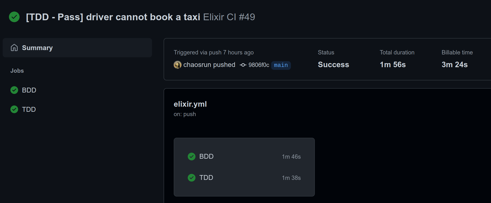

## Trello Board

I used trello board to track my progress, link is [here](https://trello.com/b/Ig7QgKHt/takso).

## Screenshots

Customer -> Logged in:

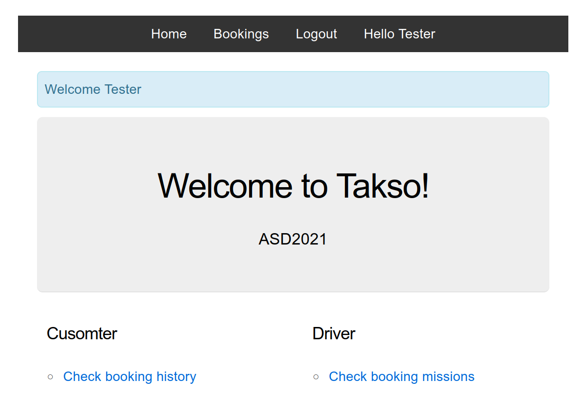

Customer -> Create a new booking:

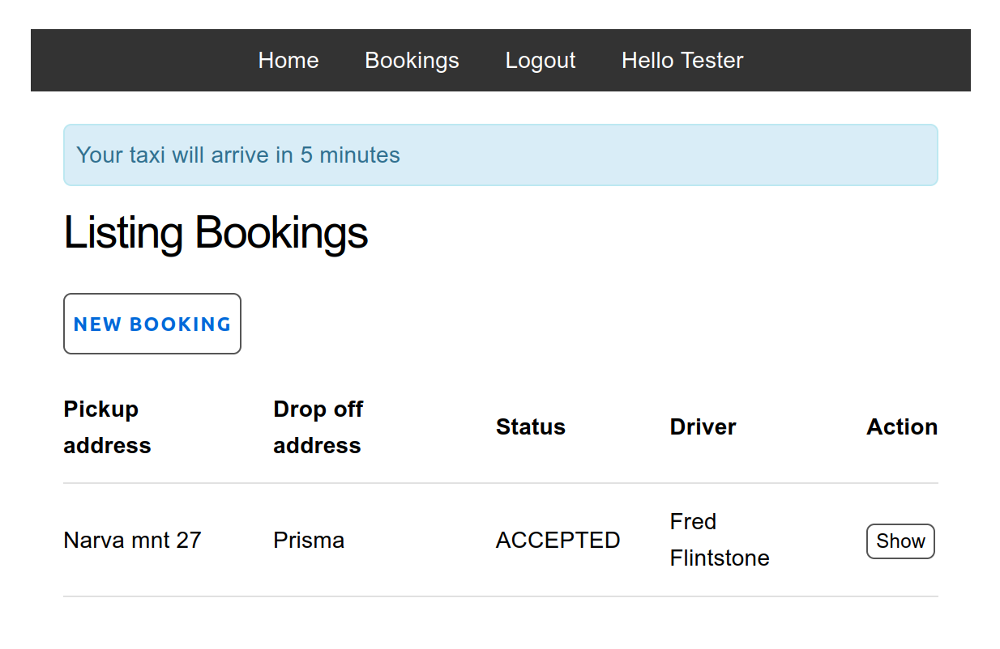

Customer -> Check booking info:

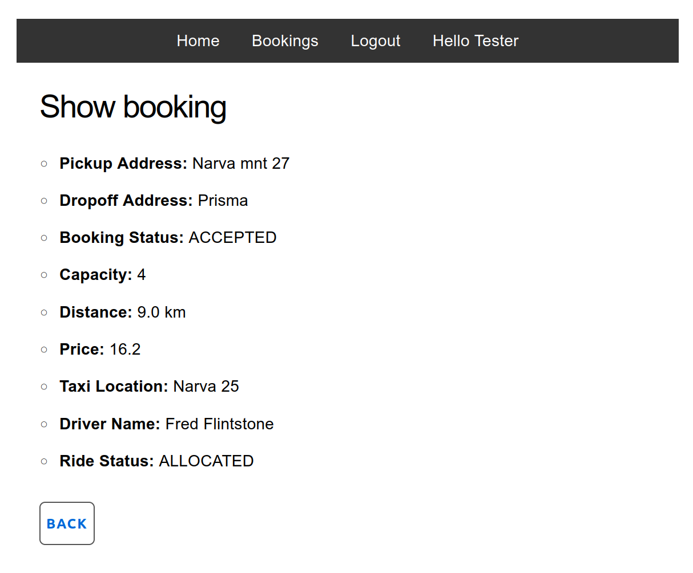

Driver -> Check missions list:

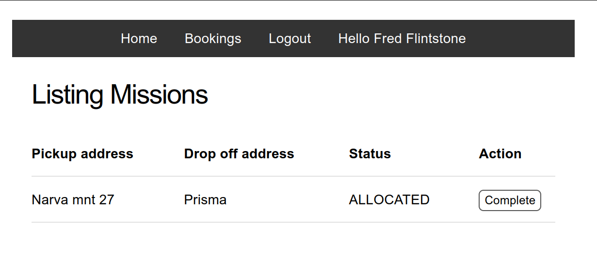

Driver -> Complete the ride:

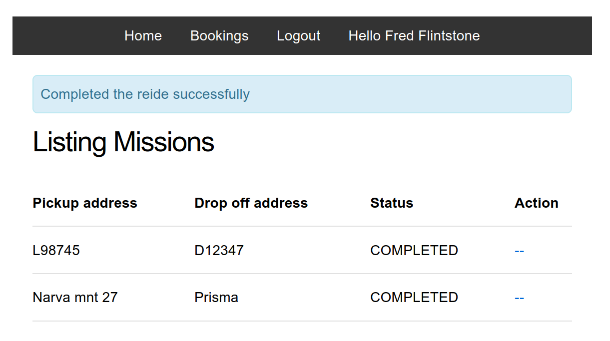

Redirect -> Before making actions, Log in first:

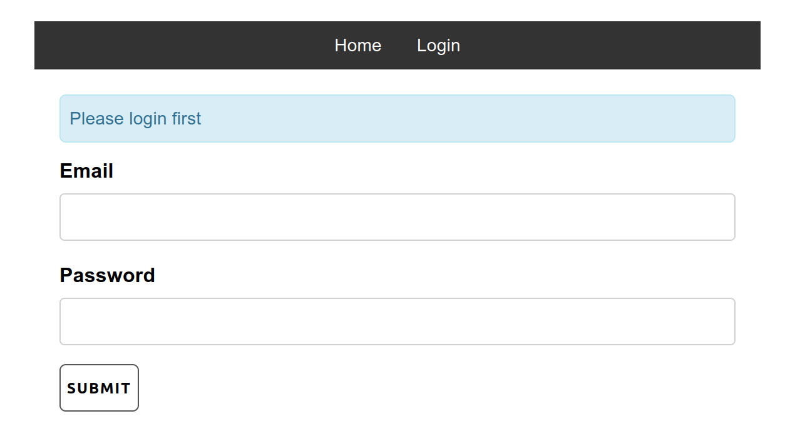

Restriction -> Addresses cannot be empty:

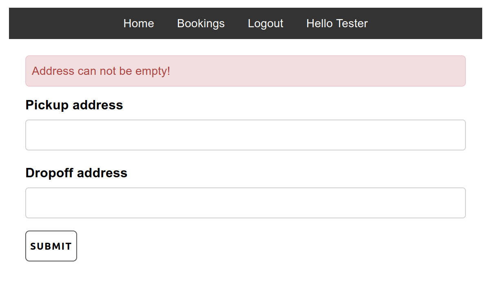

Restriction -> Addresses cannot be the same:

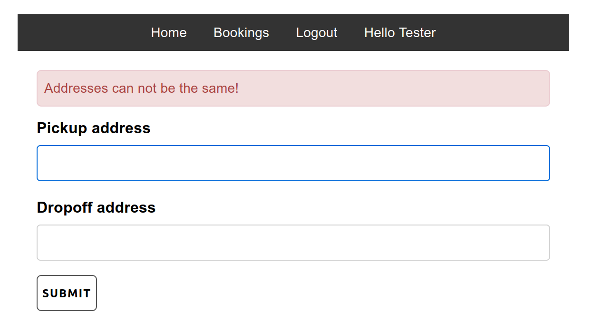

Customer -> Booking failed

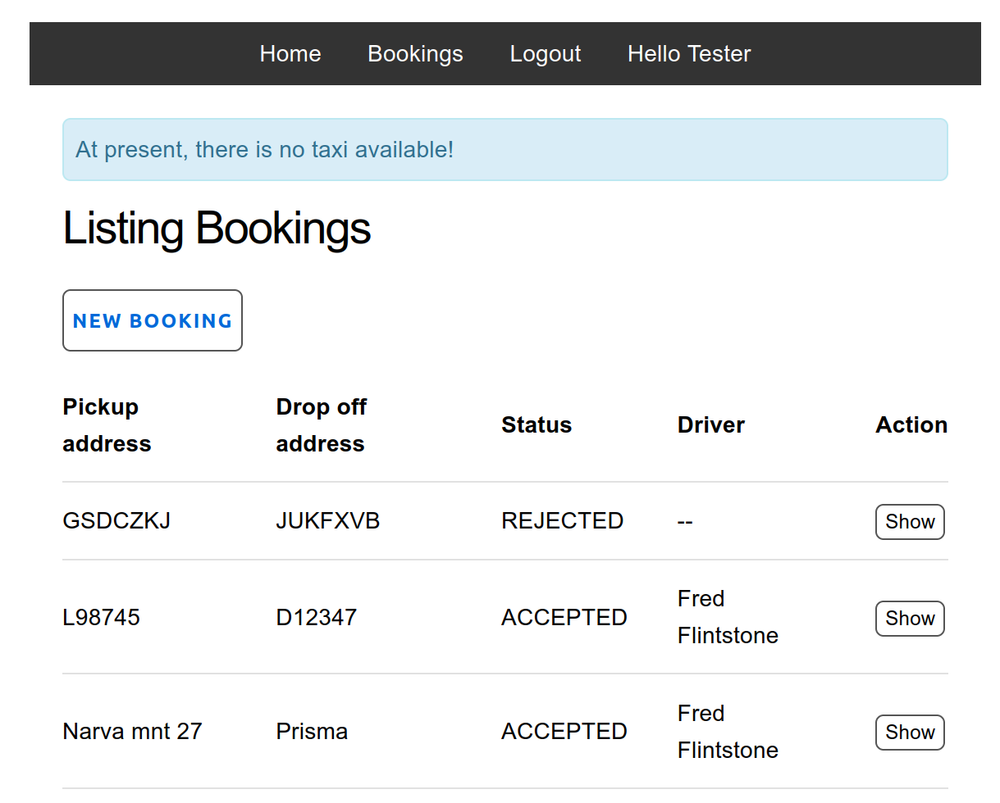

Driver -> Not allowed to book a taxi, to complete other driver ride, or to view customer's history:

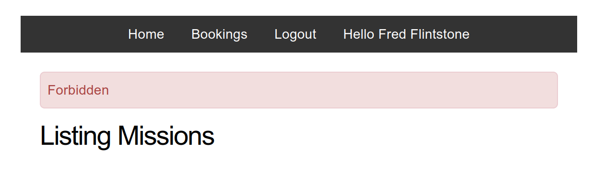

## About

Team 27: Zhaosi Qu
